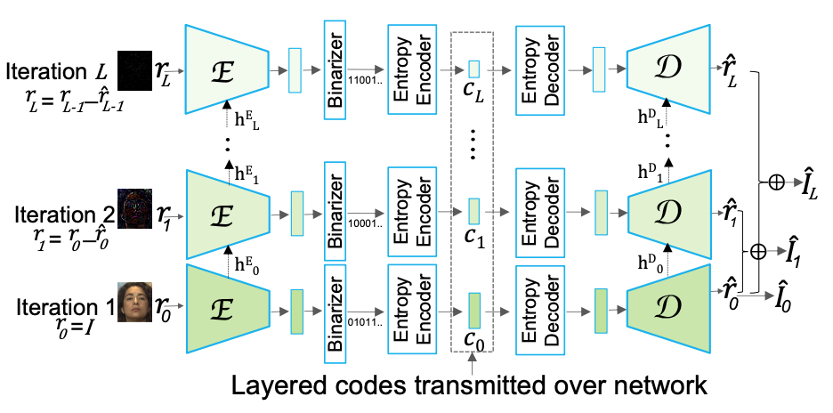

Swift: Adaptive Video Streaming with Layered Neural Codecs
==========================================================

The repository contains an implementation of the following paper. 
[Swift: Adaptive Video Streaming with Layered Neural Codecs](). 
[Mallesham Dasari](), [Kumara Kahatapitiya](), [Samir R. Das](), [Aruna Balasubramanian](), [Dimitris Samaras](). 
NSDI 2022 (Conference on Networked Systems Design and Implementation). 

It has three independent codebases: 1) Motion flow extracter, 2) Layered neural codec located in the codec folder, 3) Adaptive video streaming pipeline using the proposed layered neural codec, located in streamer folder.

Network Architecture
--------------------

  

